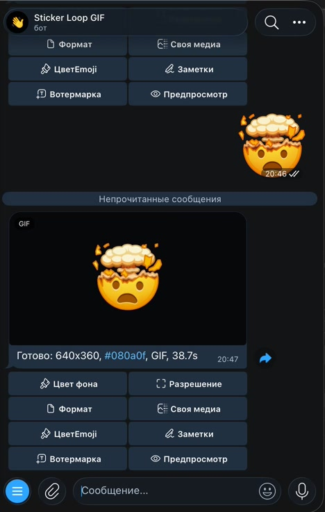

<div align="center">

# 🌀 Telegram Sticker Loop Bot

**Turn any Telegram sticker or premium / custom emoji into a clean, looping GIF-style animation — on the background of your choice.**

Send a sticker, get back a buttery MP4 that Telegram renders as a GIF. Animated `.tgs`, video `.webm`, static stickers, inline custom emoji, whole packs — all handled.

[](https://www.python.org/)
[](https://github.com/python-telegram-bot/python-telegram-bot)
[](https://nodejs.org/)
[](LICENSE)

</div>

---

## 📸 Demo

Send a sticker → get back a looping MP4.

**[Try it live: @StickerLoopBot](https://t.me/StickerLoopBot)**


Chat interface:



## ✨ What it does

You throw stickers at it. It throws back loops.

| Input | Supported |
|---|---|
| 🎞️ Animated stickers & emoji (`.tgs` / Lottie) | ✅ |
| 📹 Video stickers & emoji (`.webm` / VP9) | ✅ |
| 🖼️ Static stickers | ✅ (short still loop) |
| 😎 Inline custom & premium emoji from a text message | ✅ |
| 📦 Sticker / emoji packs (`t.me/addemoji/…`, `t.me/addstickers/…`) | ✅ (first few items) |
| 🧑‍🎨 Your own photo / video / GIF / document | ✅ |

Output is a silent H.264 MP4 sent via `sendAnimation` — smaller and crisper than a real GIF, and Telegram shows it as one.

## 🎨 Features

- **Backgrounds on tap** — preset palette via inline buttons, or any hex you want: `/bg #101820`.
- **Full inline menu** — change resolution, FPS, delivery mode (GIF / video / file), emoji recolor, notes, and an optional watermark, all by editing the same message instead of spamming the chat.
- **Lottie rendering done right** — `.tgs` animations are rendered through `lottie-web` in a headless Chromium (Playwright), then muxed with `ffmpeg`.
- **Built-in anti-abuse** — global render cap, per-user concurrency, rate limits, min gap between jobs, and auto temporary bans for repeat offenders. Bans persist across restarts.
- **Owner tooling** — new-user logging, optional render logging, two-step `/broadcast` with confirmation, blocked-user pruning, and admin-curated menu assets.
- **Conservative production defaults** — size caps, render timeouts, and automatic cleanup of stale temp dirs.

## 🚀 Quick start

### Docker (recommended)

```bash
git clone https://github.com/lemonchikHere/telegram-sticker-loop-bot.git
cd telegram-sticker-loop-bot
cp .env.example .env
#   → set BOT_TOKEN (from @BotFather)
docker compose up
```

That's it — Chromium, ffmpeg, Node.js, and Python are all inside the container.

### Manual setup

**Requirements:** Python 3.12+, Node.js + npm, `ffmpeg` & `ffprobe` on `PATH`, and a local Chromium / Chrome.

```bash
git clone https://github.com/lemonchikHere/telegram-sticker-loop-bot.git
cd telegram-sticker-loop-bot

# Python deps
python3 -m venv .venv
.venv/bin/python -m pip install -r requirements.txt

# Node deps (lottie-web + playwright-core)
npm install

# Config
cp .env.example .env
#   → set BOT_TOKEN (from @BotFather)
#   → set CHROME_PATH to your Chrome/Chromium binary

# Run
.venv/bin/python src/bot.py
```

> The bot uses long polling — no public URL or webhook required.

## ⚙️ Configuration

Everything is driven by `.env`. Key knobs (see [`.env.example`](.env.example) for the full list):

| Variable | Purpose | Default |
|---|---|---|
| `BOT_TOKEN` | Telegram bot token from @BotFather | — |
| `CHROME_PATH` | Path to the Chrome/Chromium binary used by Playwright | — |
| `OUTPUT_WIDTH` / `OUTPUT_HEIGHT` / `OUTPUT_FPS` | Default render geometry | `640×360 @ 30` |
| `DEFAULT_OUTPUT_FORMAT` | `gif`, `video`, or `file` | `gif` |
| `DEFAULT_BACKGROUND` | Default backdrop preset | `dark` |
| `MAX_GLOBAL_RENDERS` | Concurrent renders across all users | `2` |
| `PER_USER_WINDOW_JOBS` / `PER_USER_WINDOW_SECONDS` | Per-user rate limit | `2 / 60s` |
| `BAN_SECONDS` | Temp ban length after repeated abuse | `3600` |
| `MAX_SOURCE_BYTES` / `MAX_OUTPUT_BYTES` | File size caps | `10 MB / 45 MB` |
| `RENDER_TIMEOUT_SECONDS` | Hard timeout per render | `75` |
| `ADMIN_USER_IDS` | Comma-separated admin IDs (broadcast, menu assets) | — |
| `LOG_CHAT_ID` | Chat to log new users / render requests | — |
| `WATERMARK_ENABLED` | Subtle text watermark on output | `false` |

## 🤖 Commands

| Command | Who | Description |
|---|---|---|
| `/start`, `/help` | everyone | Usage + inline menu |
| `/bg` | everyone | Pick a background |
| `/bg #RRGGBB` | everyone | Custom hex background |
| `/settings` | everyone | Current render settings |
| `/limits` | everyone | Active anti-abuse / render limits |
| `/whoami` | everyone | Your Telegram user ID |
| `/users` | admin | User stats |
| `/broadcast <text>` / reply | admin | Create a broadcast draft |
| `/broadcast_send <id>` | admin | Confirm & send a draft |
| `/broadcast_cancel <id>` | admin | Cancel a draft |
| `/menu_assets`, `/menu_asset_palette` | admin | Curate menu preview GIFs |

Broadcasts are deliberately two-step: draft → explicit `/broadcast_send`. Recipients who blocked the bot are marked and skipped automatically.

## 🧱 How it works

```
Telegram sticker / emoji
        │
        ▼
  getFile / getCustomEmojiStickers   ← resolve & download source
        │
        ├─ .tgs  → lottie-web in headless Chromium (Playwright) → frames
        ├─ .webm → ffmpeg decode
        └─ static → single-frame loop
        │
        ▼
   ffmpeg compose on chosen background  → silent H.264 MP4
        │
        ▼
   sendAnimation  → Telegram shows it as a GIF
```

- `src/bot.py` — the bot: handlers, inline menu, rate limiting, broadcasts, SQLite user store, ffmpeg pipeline.
- `src/render_lottie.mjs` — headless Lottie renderer (lottie-web + playwright-core).

## 📚 References

- [Telegram Bot API — Stickers](https://core.telegram.org/bots/api#sticker)
- [`getCustomEmojiStickers`](https://core.telegram.org/bots/api#getcustomemojistickers)
- [`getFile`](https://core.telegram.org/bots/api#getfile)
- [`sendAnimation`](https://core.telegram.org/bots/api#sendanimation)
- [Telegram Stickers overview](https://core.telegram.org/stickers)

## ⭐ Support

Bot is free and open source. If you find it useful:

- **Star the repo** — helps others discover it
- **Report bugs** — open an issue with steps to reproduce
- **Say hi** — [@lewombats](https://t.me/lewombats) on Telegram

## 📄 License

[MIT](LICENSE) — do whatever, just keep the notice.

---

<div align="center">
Made for everyone who ever wanted a sticker as a clean little loop. 🌀
</div>
